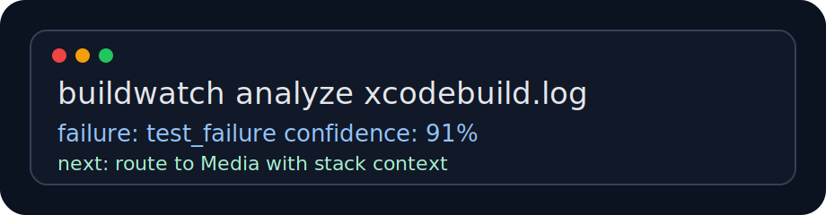
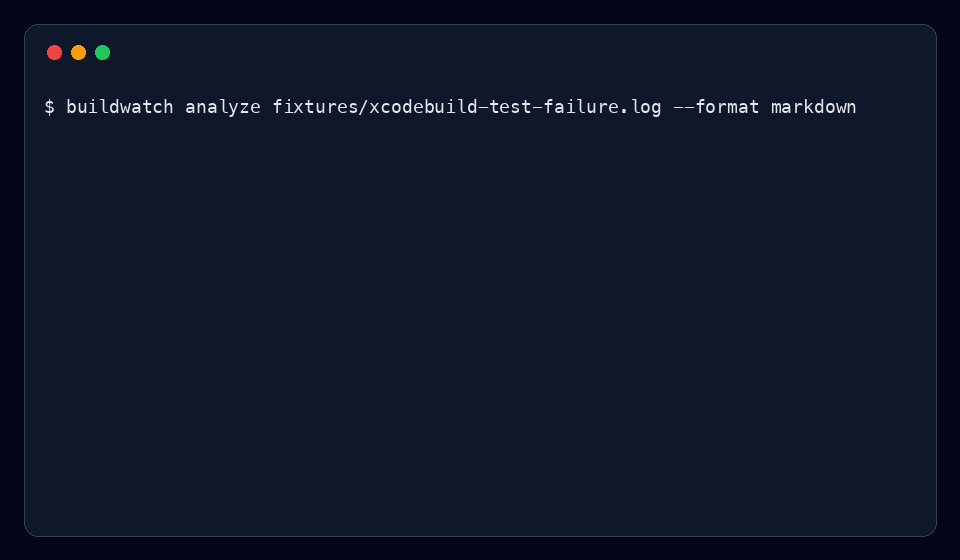

# apple-buildwatch



> From raw build failure to owner, evidence, and next action.

Swift 6 command-line tool for Apple-style build observability. It analyzes `xcodebuild`, XCTest, and Makefile logs, classifies the failure, extracts stack context, reads git metadata, and generates a status report that engineering, QA, and program-management partners can act on.




---

## Why I built it

Build failures are expensive when the first part of the incident is figuring out whether the problem belongs to product code, tests, simulator infrastructure, signing, dependency resolution, a network fetch, or the build worker itself.

`apple-buildwatch` treats a failed build like a small incident:

- capture the log
- classify the failure
- extract stack or file-line context
- attach git branch, SHA, and changed files
- suggest the next action
- produce a short status report

This is intentionally rules-first. The output is fast, testable, and explainable.

---

## What it looks like

```bash
$ swift run buildwatch analyze fixtures/xcodebuild-test-failure.log

buildwatch
status: failed
failure: test_failure
confidence: 91%
branch: main
sha: abc1234
likely_owner: Media

summary:
  XCTest reported a product or test assertion failure.

suggested_action:
  Open the failing test, compare recent git changes, and confirm whether the failure reproduces locally.

evidence:
  line 3: Sources/MediaPlaybackTests.swift:88: error: -[MediaPlaybackTests testSegmentOrdering] : XCTAssertEqual failed
  line 4: Test Case '-[MediaPlaybackTests testSegmentOrdering]' failed (2.3 seconds).

stack_context:
  Sources/MediaPlaybackTests.swift:88 error: -[MediaPlaybackTests testSegmentOrdering] : XCTAssertEqual failed
```

Markdown output:

```bash
swift run buildwatch analyze fixtures/xcodebuild-test-failure.log --format markdown
```

JSON output:

```bash
swift run buildwatch analyze fixtures/make-linker-error.log --format json
```

---

## Features

- `xcodebuild` and XCTest log classification
- Makefile and linker error support
- stack trace and file-line extraction
- git branch, SHA, and changed-file context
- Markdown, JSON, and terminal output
- build command wrapper for `make`, `xcodebuild`, or generic shell commands
- distributed build scheduler simulation with critical path and retry accounting
- fixtures for compiler, linker, simulator, and test failures
- Swift XCTest coverage for the classifier, stack parser, and scheduler

---

## Failure categories

| Category | Example signal |
|---|---|
| `compiler_error` | unresolved identifier, type mismatch, SwiftCompile failed |
| `linker_error` | undefined symbols, duplicate symbol, linker command failed |
| `test_failure` | XCTest assertion or `** TEST FAILED **` |
| `flaky_test_candidate` | async timeout or intermittent signal |
| `simulator_failure` | CoreSimulator or simctl boot timeout |
| `code_signing_failure` | provisioning profile or signing certificate |
| `missing_dependency` | no such module, package resolution failed |
| `network_failure` | artifact download or remote fetch failure |
| `infrastructure_failure` | disk full, xcode-select, DerivedData, worker pressure |

See [docs/failure-taxonomy.md](docs/failure-taxonomy.md).

---

## Architecture

```text
xcodebuild / make / saved CI log
          |
          v
BuildRunner or log file input
          |
          v
LogClassifier
  - compiled regular-expression rules
  - confidence scoring
  - failure category
          |
          +--> StackTraceExtractor
          +--> GitContextProvider
          +--> OwnerResolver
          |
          v
ReportWriter
  - terminal
  - markdown
  - json
```

The repo also includes `SchedulerSimulation`, a small local model of distributed build execution. It tracks dependencies, retries infrastructure-sensitive jobs, and reports the critical path.

---

## Install

```bash
git clone https://github.com/gerardrecinto/apple-buildwatch.git
cd apple-buildwatch
swift build -c release
```

Run from source:

```bash
swift run buildwatch analyze fixtures/xcodebuild-compiler-error.log
```

Install locally:

```bash
cp .build/release/buildwatch /usr/local/bin/buildwatch
```

---

## Commands

```bash
buildwatch analyze <log-path> [--format terminal|json|markdown]
buildwatch run -- <command> [args...]
buildwatch simulate
```

Examples:

```bash
buildwatch analyze fixtures/xcodebuild-test-failure.log --format markdown
buildwatch analyze fixtures/make-linker-error.log
buildwatch run -- make test
buildwatch simulate
```

---

## Development

```bash
swift build
swift test
swift run buildwatch analyze fixtures/xcodebuild-test-failure.log --format markdown
```

Docs:

- [Runbook](docs/runbook.md)
- [Failure taxonomy](docs/failure-taxonomy.md)
- [Sample status report](docs/sample-status-report.md)

---

## Why this is different from a generic CI dashboard

This is not trying to be a dashboard. It is a build engineer's first-response tool. The useful output is a small answer:

- what failed
- why the tool thinks so
- where the evidence is
- who likely owns it
- what to do next

That makes it useful during handoffs, release readiness checks, and build failure triage.

---

## License

MIT
