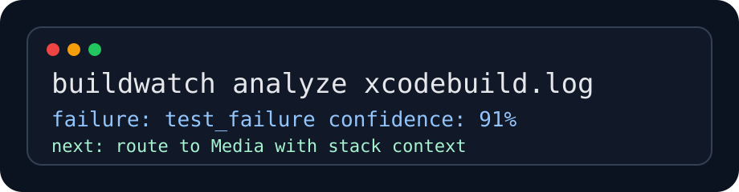

# apple-buildwatch




> From raw build failure to owner, evidence, and next action.

Swift 6 command-line tool for Apple-style build observability. It analyzes `xcodebuild`, XCTest, and Makefile logs, classifies the failure, extracts stack context, reads git metadata, and generates a status report that engineering, QA, and program-management partners can act on.


---

## Why I built it

Build failures are expensive when the first part of the incident is figuring out whether the problem belongs to product code, tests, simulator infrastructure, signing, dependency resolution, a network fetch, or the build worker itself.

`apple-buildwatch` treats a failed build like a small incident:

- capture the log
- classify the failure
- extract stack or file-line context
- attach git branch, SHA, and changed files
- suggest the next action
- produce a short status report

This is intentionally rules-first. The output is fast, testable, and explainable.

---

## What it looks like

```bash
$ swift run buildwatch analyze fixtures/xcodebuild-test-failure.log

buildwatch
status: failed
failure: test_failure
confidence: 91%
branch: main
sha: abc1234
likely_owner: Media
owner_confidence: medium
ownership_source: git-history heuristic
ownership_evidence: keyword "media" matched in: Sources/MediaPlaybackTests.swift

summary:
  XCTest reported a product or test assertion failure.

suggested_action:
  Open the failing test, compare recent git changes, and confirm whether the failure reproduces locally.

evidence:
  line 3: Sources/MediaPlaybackTests.swift:88: error: -[MediaPlaybackTests testSegmentOrdering] : XCTAssertEqual failed
  line 4: Test Case '-[MediaPlaybackTests testSegmentOrdering]' failed (2.3 seconds).

stack_context:
  Sources/MediaPlaybackTests.swift:88 error: -[MediaPlaybackTests testSegmentOrdering] : XCTAssertEqual failed
```

Markdown output:

```bash
swift run buildwatch analyze fixtures/xcodebuild-test-failure.log --format markdown
```

JSON output:

```bash
swift run buildwatch analyze fixtures/make-linker-error.log --format json
```

---

## Features

- `xcodebuild` and XCTest log classification
- Makefile and linker error support
- stack trace and file-line extraction
- git branch, SHA, and changed-file context
- CODEOWNERS-aware ownership resolution with confidence and evidence
- `compare`: build-over-build diff between two JSON reports (regressed/resolved/persisting/changed), exits 1 on regression for CI gating
- Markdown, JSON, and terminal output
- build command wrapper for `make`, `xcodebuild`, or generic shell commands
- distributed build scheduler simulation with critical path and retry accounting
- fixtures for compiler, linker, simulator, and test failures
- Swift XCTest coverage for the classifier, stack parser, and scheduler
- `version` command: prints build version and platform info

---

## Failure categories

| Category | Example signal |
|---|---|
| `compiler_error` | unresolved identifier, type mismatch, SwiftCompile failed |
| `linker_error` | undefined symbols, duplicate symbol, linker command failed |
| `test_failure` | XCTest assertion or `** TEST FAILED **` |
| `flaky_test_candidate` | async timeout or intermittent signal |
| `simulator_failure` | CoreSimulator or simctl boot timeout |
| `code_signing_failure` | provisioning profile or signing certificate |
| `missing_dependency` | no such module, package resolution failed |
| `network_failure` | artifact download or remote fetch failure |
| `infrastructure_failure` | disk full, xcode-select, DerivedData, worker pressure |

See [docs/failure-taxonomy.md](docs/failure-taxonomy.md).

---

## Ownership resolution

`buildwatch` tries to answer "who likely owns this failure," not just "what failed." It resolves an owner in this order, stopping at the first match:

1. **Explicit override** -- an optional `.buildwatch-owners.json` file at the repo root, for teams that want to hardcode a friendly owner name for a path.
2. **CODEOWNERS** -- `.github/CODEOWNERS`, `CODEOWNERS`, or `docs/CODEOWNERS` (checked in that order; the first one found is used). Patterns are matched against the failure's file path using real CODEOWNERS/gitignore glob semantics -- `*`, `**`, anchored vs. unanchored patterns, and **last match wins** when multiple patterns match the same path.
3. **Git-history heuristic** -- a lower-confidence fallback: a keyword match (e.g. "media", "network", "test") in the failure evidence or changed files, or, failing that, the directory of the first git-changed file.
4. **Unknown** -- when nothing above matches. `buildwatch` reports `unknown` with `none` confidence rather than guessing.

Every resolution reports a `confidence` and an `evidence` trail explaining why:

| Confidence | Meaning |
|---|---|
| `high` | A file path directly matched an explicit override or a CODEOWNERS pattern. |
| `medium` | A keyword heuristic matched failure evidence, stack frames, or changed files. |
| `low` | No path or keyword match; fell back to the directory of the first git-changed file. |
| `none` | No evidence at all; owner is `unknown`. |

Use `--owners auto` (the default) for full resolution, or `--owners off` to skip the config/CODEOWNERS lookup and use only the heuristic fallback:

```bash
buildwatch analyze fixtures/xcodebuild-test-failure.log --owners auto
buildwatch analyze fixtures/xcodebuild-test-failure.log --owners off
```

`.buildwatch-owners.json` format:

```json
{
  "overrides": [
    { "pattern": "Sources/Media/**", "owner": "Media Platform Team" }
  ]
}
```

---

## Architecture

```text
xcodebuild / make / saved CI log
          |
          v
BuildRunner or log file input
          |
          v
LogClassifier
  - compiled regular-expression rules
  - confidence scoring
  - failure category
          |
          +--> StackTraceExtractor
          +--> GitContextProvider
          +--> OwnerResolver
                 - .buildwatch-owners.json (explicit override)
                 - CODEOWNERS (glob match, last match wins)
                 - git-history heuristic (fallback)
          |
          v
ReportWriter
  - terminal
  - markdown
  - json
```

The repo also includes `SchedulerSimulation`, a small local model of distributed build execution. It tracks dependencies, retries infrastructure-sensitive jobs, and reports the critical path.

---

## Install

### Download binary (macOS)

Download the latest `buildwatch` binary from [Releases](https://github.com/gerardrecinto/apple-buildwatch/releases):

```bash
curl -L https://github.com/gerardrecinto/apple-buildwatch/releases/latest/download/buildwatch -o buildwatch
chmod +x buildwatch
mv buildwatch /usr/local/bin/buildwatch
```

### Build from source

```bash
git clone https://github.com/gerardrecinto/apple-buildwatch.git
cd apple-buildwatch
swift build -c release
cp .build/release/buildwatch /usr/local/bin/buildwatch
```

Run from source:

```bash
swift run buildwatch analyze fixtures/xcodebuild-compiler-error.log
```

---

## Commands

```bash
buildwatch analyze <log-path> [--format terminal|json|markdown] [--owners auto|off]
buildwatch run -- <command> [args...] [--format terminal|json|markdown] [--owners auto|off]
buildwatch compare <previous.json> <current.json> [--format terminal|json|markdown]
buildwatch simulate
buildwatch version
```

Examples:

```bash
buildwatch analyze fixtures/xcodebuild-test-failure.log --format markdown
buildwatch analyze fixtures/make-linker-error.log
buildwatch analyze fixtures/xcodebuild-test-failure.log --owners off
buildwatch run -- make test
buildwatch simulate
buildwatch version

# Build-over-build diff: is last night's failure still the same one?
buildwatch analyze build.log --format json > today.json
buildwatch compare yesterday.json today.json
```

`compare` diffs two `analyze --format json` snapshots into one transition — `regressed` (newly failing), `resolved` (newly passing), `persisting` (same failure kind both times), `changed` (still red, different failure kind than last time), or `stable`. It also flags an owner change between the two runs. Exits 1 on `regressed`, so it drops into a CI gate the same way `run`'s exit-code passthrough does.

---

## Development

```bash
swift build
swift test
swift run buildwatch analyze fixtures/xcodebuild-test-failure.log --format markdown
```

Docs:

- [Runbook](docs/runbook.md)
- [Failure taxonomy](docs/failure-taxonomy.md)
- [Sample status report](docs/sample-status-report.md)

---

## Why this is different from a generic CI dashboard

This is not trying to be a dashboard. It is a build engineer's first-response tool. The useful output is a small answer:

- what failed
- why the tool thinks so
- where the evidence is
- who likely owns it
- what to do next

That makes it useful during handoffs, release readiness checks, and build failure triage.

---

## License

MIT
